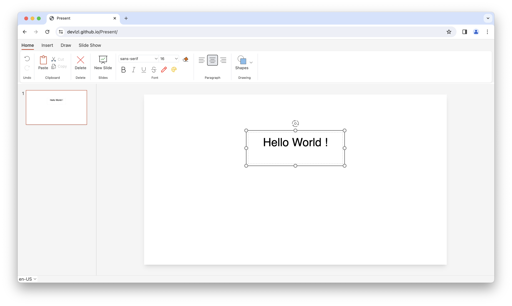

# Present

## Introduction

Present is a web-based presentation application.

[Try Present online](https://devlzl.github.io/Present/)

It's only been a month since the first line of code was written, and follow-up features are still being developed.

Through this project, I want to not only improve my technical skills, but also make a presentation application that works better than powerpoint online.
I implemented this project from scratch, and no functionality was done with third-party libraries.
Although the interface is built on Vue.js, the core logic and state management is almost framework-agnostic.

## Current Features

- [x] Creating, Switching, Modifying, and Showing Slides.
- [x] TextBox
  - [x] Styling Text: Font, Color, Bold, Italic, Underline, etc.
  - [x] Align: Left, Center, Right
  - [x] Clipboard: Copy, Cut, Paste
  - [x] History: Undo, Redo
- [x] Picture
  - [x] Resize, Position, Orientation
- [x] Table
- [x] Shapes
- [x] Canvas and Pen
- [x] Selection and Adjustment of Slide elements

## Technology infrastructure

- [x] Block-based data structure and page structure
- [x] Hierarchical, traceable, event-based unidirectional data flow
- [x] Data-driven rich text editor engine
  - [x] Customizable text styles
  - [x] Event management
  - [x] Selection management
  - [x] History management (undo/redo)
  - [x] Cross-browser compatibility
